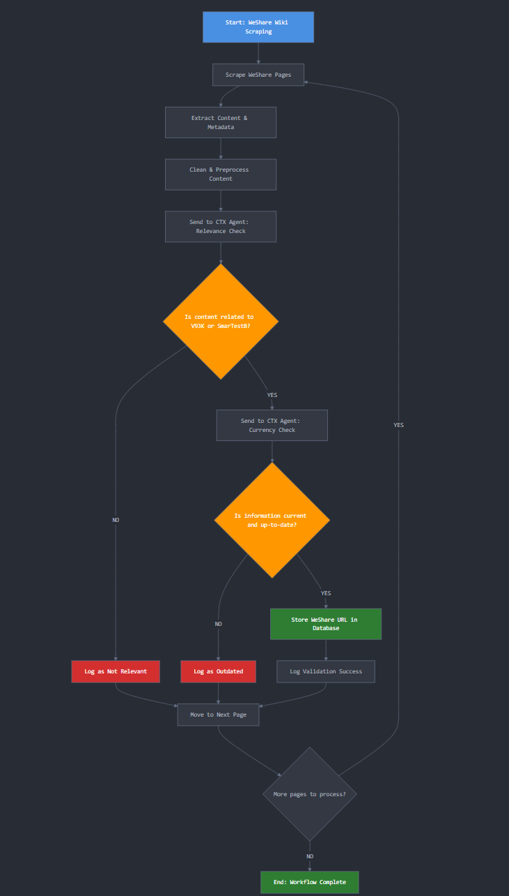

# WeShare Content Scraper & Context Relevance System

A tool for scraping and validating technical documentation from Advantest's WeShare platform. Automatically identifies V93K/SmarTest8-related content and builds a curated database of current technical resources.

## Workflow Overview



## Prerequisites

- [uv](https://docs.astral.sh/uv/) - Astral package manager
- Chrome/Chromium browser with ChromeDriver

Install uv:

```bash
# macOS/Linux
curl -LsSf https://astral.sh/uv/install.sh | sh

# Windows
powershell -c "irm https://astral.sh/uv/install.ps1 | iex"
```

## (Current) Project Structure

```
weshare-ctx-sort/
├── runnables/
│   │   ├── run_ctx_agent.py          # Contextual Agent Pipeline
│   │   └── run_scraper.py            # Scraper Pipeline
├── src/
│   ├── workflow/
│   │   ├── sso_weshare_scraper.py    # Microsoft SSO scraper
│   │   └── html_to_markdown.py       # HTML to Markdown converter
│   │   ├── ctx_agent.py              # Contextual Agent Query logic

│   └── db/
│       ├── database.py               # Database operations
│       └── models.py                 # SQLAlchemy models
│   │   └── ...
├── tests/
│   └── test_database.py             # Database testing
│   │   └── ...
├── .env                             # Environment variables
└── pyproject.toml                   # uv project configuration
```

## Setup

```bash
# Install dependencies
uv sync

# Set up environment
cp .env.example .env
# Edit .env with your credentials

# Test the system
uv run python tests/test_scraper.py
```
